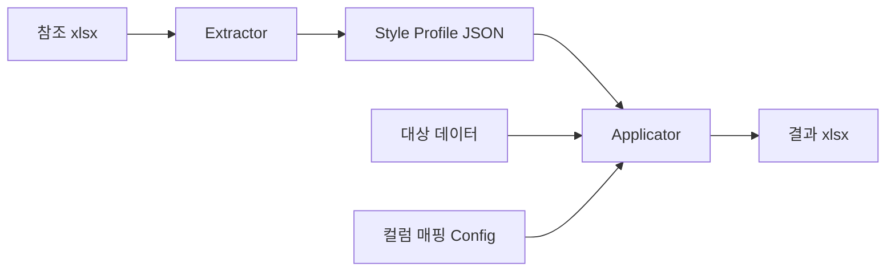

# Excel 스타일 복사 개발 리포트

> **작성일**: 2026-03-20  
> **목적**: 참조 엑셀 파일의 스타일을 추출하여 새 파일에 적용하는 자동화 모듈 개발을 위한 분석 리포트

---

## 1. 배경

### 요구사항
- 참조 엑셀 파일(템플릿)에서 셀 스타일(폰트, 색상, 테두리, 정렬, 인쇄 설정 등)을 추출
- 데이터가 담긴 대상 파일에 해당 스타일을 그대로 적용하여 새 파일 생성
- 컬럼 구성이 다를 경우(일부 컬럼 삭제/추가) 유연하게 매핑

### 실증 케이스
- **참조 파일**: `(리스트) 전자IoT가전산업 인력실태조사_260320.xlsx` (35컬럼, 28,319건)
- **대상 데이터**: `contact_list_target_5000_260320.xlsx` (25컬럼, 5,000건)
- **결과 파일**: `contact_list_target_5000_260320_2603.xlsx`

---

## 2. 스타일 추출 항목

### 2-1. 추출 가능 항목 (openpyxl 기준)

| 카테고리 | 항목 | API | 비고 |
|---|---|---|---|
| **폰트** | name, size, bold, italic, color | `cell.font` | theme color 별도 처리 필요 |
| **배경** | fill_type, fgColor, bgColor | `cell.fill` | theme 기반 색상 주의 |
| **정렬** | horizontal, vertical, wrap_text | `cell.alignment` | |
| **테두리** | left/right/top/bottom style, color | `cell.border` | Side 객체 |
| **숫자 형식** | number_format | `cell.number_format` | |
| **컬럼 너비** | width, hidden | `ws.column_dimensions[col]` | |
| **행 높이** | height | `ws.row_dimensions[row]` | |
| **틀 고정** | freeze_panes | `ws.freeze_panes` | |
| **자동 필터** | auto_filter.ref | `ws.auto_filter` | ⚠️ 신규 생성 시 주의 |
| **페이지 설정** | orientation, paperSize, scale | `ws.page_setup` | |
| **여백** | left, right, top, bottom, header, footer | `ws.page_margins` | |
| **인쇄 제목** | print_title_rows, print_title_cols | `ws.print_title_rows` | |
| **인쇄 영역** | print_area | `ws.print_area` | ⚠️ 잘못된 형식 시 Excel 오류 |
| **병합 셀** | merged_cells | `ws.merged_cells.ranges` | |

### 2-2. Theme 색상 처리

Excel 내부에서 색상을 **theme 인덱스 + tint** 형태로 저장하는 경우가 많음.
openpyxl에서 이를 그대로 사용하면 **xlsx XML 손상** 위험이 있어 반드시 RGB로 변환 필요.

**Theme 색상 변환 절차:**

```
1. xlsx를 zipfile로 열어 xl/theme/theme1.xml 읽기
2. clrScheme에서 dk1, lt1, dk2, lt2, accent1~6 순서로 base RGB 추출
3. tint 값으로 HSL 밝기 보정 적용
4. 최종 RGB 헥스 값 산출
```

**Theme 인덱스 매핑 (표준):**

| theme | 역할 | 일반적 값 |
|---|---|---|
| 0 | dk1 (어두운 1) | `#000000` |
| 1 | lt1 (밝은 1) | `#FFFFFF` |
| 2 | dk2 (어두운 2) | `#1F497D` |
| 3 | lt2 (밝은 2) | `#EEECE1` |
| 4-9 | accent1-6 | 테마별 상이 |

> [!IMPORTANT]
> **Excel의 폰트 theme 인덱스는 반전됨**: theme=0은 폰트용도에서 lt1(흰색)을 참조.
> 따라서 `font.color.theme=0` → 실제로 **흰색(#FFFFFF)**.

**Tint 적용 공식:**

```python
import colorsys

def apply_tint(hex_color, tint):
    r, g, b = [int(hex_color[i:i+2], 16) / 255.0 for i in (0, 2, 4)]
    h, l, s = colorsys.rgb_to_hls(r, g, b)
    if tint < 0:
        l = l * (1 + tint)        # 어둡게
    else:
        l = l * (1 - tint) + tint  # 밝게
    r2, g2, b2 = colorsys.hls_to_rgb(h, l, s)
    return f"{int(r2*255):02X}{int(g2*255):02X}{int(b2*255):02X}"
```

---

## 3. 권장 아키텍처

### 3-1. 모듈 구성안

```
excel_automation/
├── style_copier/
│   ├── __init__.py
│   ├── extractor.py      # 참조 파일에서 스타일 추출
│   ├── theme_resolver.py # theme → RGB 변환
│   ├── applicator.py     # 대상 데이터에 스타일 적용
│   └── config.py         # 컬럼 매핑 설정
├── docs/
│   ├── style_copy_development_report.md
│   └── style_copy_troubleshooting.md
└── examples/
    └── apply_ref_style.py
```

### 3-2. 워크플로우



### 3-3. Style Profile JSON 구조 (설계안)

```json
{
  "sheet_name": "전체",
  "page_setup": {
    "orientation": "landscape",
    "paper_size": 8,
    "scale": 64,
    "margins": { "left": 0.354, "right": 0.433, "top": 0.748, "bottom": 0.748 }
  },
  "freeze_panes": "A3",
  "print_title_rows": "1:1",
  "row_heights": { "header": 50.1, "spacer": 21.75, "data": 30.0 },
  "columns": [
    {
      "key": "nid",
      "header_label": "nid",
      "width": 13.0,
      "hidden": false,
      "data_align": "left",
      "header_wrap": false
    }
  ],
  "styles": {
    "header": {
      "font": { "name": "KoPubWorld돋움체 Bold", "size": 16, "bold": false, "color": "FFFFFF" },
      "fill": { "color": "938953" },
      "alignment": { "h": "center", "v": "center" },
      "border": { "style": "thin", "sides": ["left", "right", "top", "bottom"] }
    },
    "data": {
      "font": { "name": "KoPubWorld돋움체 Medium", "size": 16, "bold": false },
      "alignment": { "v": "center" },
      "border": { "style": "thin", "sides": ["left", "right", "bottom"] }
    },
    "spacer": {
      "fill": { "color": "FFFFFF" },
      "height": 21.75
    }
  }
}
```

---

## 4. 핵심 설계 원칙

### 4-1. 새 워크북 생성 방식 사용

- `load_workbook()` + `insert_rows()` 조합은 **xlsx XML 손상 위험**이 높음
- 반드시 `Workbook()` 으로 새로 생성 후 데이터와 스타일을 직접 기록

### 4-2. RGB 직접 지정

- `Color(theme=N, tint=T)` API는 openpyxl에서 불안정
- 모든 색상은 **6자리 RGB 헥스 문자열**로 변환 후 사용

### 4-3. 컬럼 매핑 분리

- 참조 파일과 대상 파일의 컬럼 구성이 다를 수 있음
- 컬럼 매핑을 config로 분리하여 재사용성 확보

### 4-4. 인쇄/필터 설정 최소화

- `auto_filter`, `print_area`는 Excel 버전/호환성 문제가 빈번
- 필수가 아니면 생략하거나, 생성 후 수동 설정 권장

---

## 5. 향후 개발 계획

| 단계 | 내용 | 우선순위 |
|---|---|---|
| 1 | `theme_resolver.py` — theme XML → RGB 자동 변환기 | 높음 |
| 2 | `extractor.py` — 참조 파일 → Style Profile JSON 추출 | 높음 |
| 3 | `applicator.py` — JSON + 데이터 → 결과 xlsx 생성 | 높음 |
| 4 | 컬럼 매핑 config YAML/JSON 지원 | 중간 |
| 5 | 조건부 서식(conditional formatting) 복사 | 낮음 |
| 6 | 차트/이미지 복사 지원 | 낮음 |
