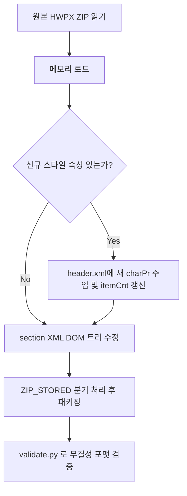

# HWPX 수정 프로세스 설계 (확장판)

원본 HWPX → 파싱/분석 → 본문 수정 → 신규 HWPX 생성의 3단계 파이프라인


---

## ① 파싱/분석 단계

원본 HWPX의 구조를 분석하고, 이후 수정에 필요한 **메타데이터를 수집**하는 단계입니다. 특히 문서의 계층(제목 등)과 스타일을 정확하게 식별하는 것이 중요합니다.

### 실행 도구

```bash
analyze_template.py <원본.hwpx> --extract-header <header.xml> --extract-section <section0.xml>
```

### 🎯 본문 계층(대제목, 소제목, 일반 텍스트 등) 구조 및 서식 파악

본문 수정 단계에서 제목만 필터링하거나, 소제목 아래에만 내용을 추가하려면 파싱 단계에서 아래 속성들을 매핑해야 합니다:

1. **폰트, 크기, 색상 식별 (`charPr`)**
   - 각 문단(`<hp:p>`) 혹은 문구(`<hp:run>`)가 참조하는 `charPrIDRef`의 값을 `header.xml`에서 추적합니다.
   - **글자 크기**(`height`), **글자 색상** (`textColor`), **사용 폰트**(`fontRef`), **진하게/기울임**(`bold`, `italic`), **자간/장평**(`spacing`, `ratio`) 등을 읽어 일반 본문(예: height=1000)과 대제목(예: height=2000, bold="1")을 구분합니다.
2. **위치 및 정렬 식별 (`paraPr`)**
   - 각 문단의 `paraPrIDRef` 값을 추적하여 문단의 구조적 위치를 파악합니다.
   - **정렬 기준**(`align` - 양쪽/가운데/오른쪽 정렬), **들여쓰기/여백**(`indent`, `leftMargin`), **줄 간격**(`lineSpacing`) 등을 분석해 목차와 표 제목 등을 구조적으로 분류할 수 있습니다.
3. 이 정보들을 조합하여 `parse_hwpx.py` 실행 시 텍스트를 단순 나열하지 않고, **마크다운 헤더(`#`, `##`) 형태 등의 위계적 구조로 출력(`parsed_output.md`)**하게 됩니다.

### 수집 핵심 정보 목록

| 항목 | 설명 | 활용처 |
|------|------|--------|
| **charPr 목록** | 전체 charPr id와 속성 (폰트, 크기, 색상) | 문단 계층 판단 및 신규 스타일 추가 |
| **paraPr 목록** | 문단 스타일 id별 속성 (정렬, 들여쓰기) | 삽입 문단의 paraPrIDRef 결정 / 제목 위치 파악 |
| **borderFill 목록** | 테두리/배경 스타일 id | 표 디자인 보존 및 표 수정 시 참조 |
| **본문 문단 구조** | 각 `<hp:p>`의 paraPrIDRef, charPrIDRef, 텍스트 | 수정 대상(계층) 식별 |
| **표(tbl) 구조** | 행/열 수, 셀별 텍스트, borderFill | 표 데이터 식별 / 구조 수정 |

---

## ② 본문 수정 단계

파싱된 계층적 메타데이터를 기반으로 **수정 사양(Modification Spec)**을 정의하고 적용하는 단계

### 수정 유형 분류

| 유형 | 설명 | 예시 |
|------|------|------|
| **A. 문단 삽입** | 특정 소제목 또는 일반 문단 뒤에 새 문단 추가 | (금번 적용) 기업 발언 인라인 추가 |
| **B. 텍스트 교체** | 기존 문단의 텍스트를 변환/변경 | 수치 업데이트, 오탈자 수정 |
| **C. 스타일 변경** | 기존 문단/run의 `charPrIDRef` 변경 | 본문 중 특정 키워드 강조(볼드/색상) |
| **D. 표 데이터 수정**| 표 내부 셀 텍스트/스타일/행 삽입 | 리스트 데이터 갱신 |
| **E. 신규 스타일 주입** | `header.xml`에 새로운 `charPr` 생성 (기존 포맷 복제) | 원본에 없는 폰트색상, 밑줄 동적 부여 |

### 매칭 전략 (어디를 수정할 것인가?)

| 전략 | 설명 |
|------|------|
| `startswith` | 고유한 문장의 첫 글자로 매칭 (일반 본문 삽입 등) |
| `contains` | 키워드 포함 기반. 특정 단어가 포함된 모든 문단 대상 |
| `style_based` | **신규) 계층 기반**. "가운데 정렬 + 크기 2000인 대제목"만 찾아 타겟팅 |
| `after_table` | 문서 구조 기반. 특정 표(Header가 일치하는 표) 직후 위치 식별 |

---

## ③ HWPX 빌드 단계

### 빌드 프로세스


---

## 💡 이번 작업에서 새롭게 개발된 핵심 기술 상세 (기존 Skill 확장점)

이 프로세스 설계는 기존 `hwpxskill`에 선언되어 있던 기초적인 읽기/쓰기 스킬을 넘어, **이번 프로젝트를 수행하며 새롭게 보완/발명하여 적용한 HWPX 파일 제어 3대 기법**을 포함합니다.

### 1. `mimetype` 파일 비압축 보장화 기술 (크리티컬 에러 해결)
- **개요:** HWPX는 사실상 ZIP 파일이지만, 국제 Open Document 포맷 규격을 따르고 있어 압축 최상단의 `mimetype` 파일만큼은 **절대 압축되지 않은 형태(비압축, `ZIP_STORED`)로 존재**해야만 한컴오피스와 `validate.py`가 정상파일로 인식합니다.
- **개발점:** 파이썬의 `zipfile.ZIP_DEFLATED` 옵션을 일괄 사용할 경우 구조가 손상되어 파일이 열리지 않는 문제가 발생합니다. 이를 분기하여 빌드 스크립트 작성 시 **오직 `mimetype`만 별도로 분기해 `compress_type=zipfile.ZIP_STORED`로 저장**하도록 프로그래밍적 픽스를 개발, 검증에 완벽히 통과할 수 있게 했습니다.

### 2. 참조 무결성을 훼손하지 않는 동적 스타일(charPr) 인젝션 기법
- **개요:** 기존 스킬들은 빈번하게 "미리 템플릿에 저장되어있는 스타일 ID"만을 활용했습니다. 하지만 이번 프로젝트처럼 원본 문서에 '빨간색' 텍스트 자체가 존재하지 않을 때 어떻게 할 것인가에 대한 처리 로직입니다.
- **개발점:** 
  1. 본문의 일반 폰트(KoPubWorld바탕체 Light, 크기 10, 장평 98 등)의 `charPr`(예: id=22)를 Python 메모리 상에서 `lxml`의 `deepcopy`를 통해 정확하게 복사합니다.
  2. 복사본에 `textColor="#FF0000"` (빨간색) 속성만 오버라이딩합니다.
  3. 전체 스타일 카운트 속성인 `<hh:charProperties itemCnt="N">`을 찾아 **`N+1`로 값을 동적 갱신**하고 새 스타일에 마지막 인덱스를 부여해 주입했습니다. 이로 인해 한컴오피스 파서 충돌 없이 유연하게 확장된 디자인을 문서에 입힐 수 있게 되었습니다.

### 3. DOM 트리(DOM Tree) 구조 해석 및 인덱스 시프트(Index Shift) 방어 알고리즘
- **개요:** 단순 문자열 교체(Regex) 방식은 XML 태그 구조를 오염시키거나, 본문 텍스트가 아닌 표(Table) 안의 내용을 잘못 치환할 우려가 큽니다.
- **개발점:** 
  - `lxml`을 이용하여 문서 요소 중 `<hp:tbl>`(표) 안쪽까지 파고 들지 않고, **문서의 직접 자식(Direct Child)** 계층인 `<hp:p>`만 필터링하여 매칭 정확도를 보장했습니다.
  - 리스트를 반복하면서 요소를 삽입하면 순서가 밀려 엉뚱한 곳에 텍스트가 삽입되는(Index Shift) 문제를 차단하기 위해, **배열의 삽입 좌표를 수집한 후 역순(Reversed)으로 순회하여 자식 노드를 밀어넣는 병렬-안전(Parallel-Safe)** 방식을 도입했습니다.

---

## ④ 파이프라인 검증 및 출력

1. **자동화 검사(`validate.py`)**: HWPX 무결성 체커를 통해 압축 구조, XML Schema 규격, itemCnt 정합성을 자동 검수합니다.
2. **수동 검사 (최종 점검)**: 한컴오피스 실행을 통한 렌더링 확인 (폰트 깨짐 없음, 색상 인가 확인 등)
