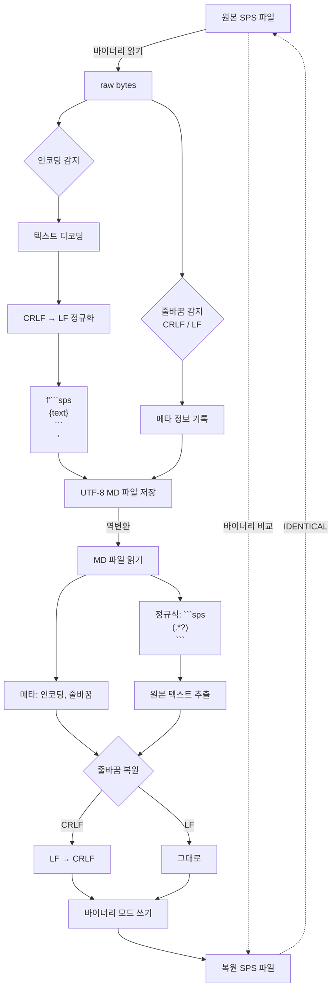

# SPS ↔ MD 변환 도구 개발 오류 리포트

> **작성일**: 2026-02-26 | **버전**: 1.0.0

왕복 변환(Round-trip) 시 바이너리 완전 일치를 달성하기까지 발생한 주요 오류와 해결 과정을 기록합니다.

---

## 목차

1. [오류 #1: 줄바꿈 패턴(CRLF/LF) 미보존](#오류-1-줄바꿈-패턴crlfflf-미보존)
2. [오류 #2: 파일 시작 빈 줄 손실 — strip 함수](#오류-2-파일-시작-빈-줄-손실--strip-함수)
3. [오류 #3: 파일 시작 빈 줄 손실 — 정규식 탐욕 매칭](#오류-3-파일-시작-빈-줄-손실--정규식-탐욕-매칭)
4. [오류 #4: 파일 끝 줄바꿈 추가 — join 구분자 혼합](#오류-4-파일-끝-줄바꿈-추가--join-구분자-혼합)
5. [최종 해결 요약](#최종-해결-요약)
6. [향후 주의 사항](#향후-주의-사항)

---

## 오류 #1: 줄바꿈 패턴(CRLF/LF) 미보존

### 증상

```
원본: 25,019 bytes
복원: 24,014 bytes (1,005 bytes 감소)
줄 수: 원본 1,001줄 → 복원 998줄
```

### 원인

- `sps_to_md.py`에서 `open(file_path, "r")` 텍스트 모드로 읽기 시 Python이 자동으로 `\r\n` → `\n` 변환
- `md_to_sps.py`에서 `open(output, "w", newline="")` 로 쓸 때 원본이 CRLF였는지 LF였는지 정보 없음
- 결과적으로 CRLF(2바이트) → LF(1바이트)로 변환되어 `\r` 1,001개분(약 1,000 bytes) 손실

### 해결

```diff
# sps_to_md.py — 바이너리 모드로 읽기 + 줄바꿈 패턴 감지
- with open(file_path, "r", encoding=encoding) as f:
-     text = f.read()
- return text, encoding
+ with open(file_path, "rb") as f:
+     raw = f.read()
+ crlf_count = raw.count(b"\r\n")
+ lf_only_count = raw.count(b"\n") - crlf_count
+ line_ending = "CRLF" if crlf_count >= lf_only_count else "LF"
+ text = raw.decode(encoding)
+ return text, encoding, line_ending
```

```diff
# sps_to_md.py — 메타 정보에 줄바꿈 패턴 기록
  f"> **원본 인코딩**: `{used_encoding}`  ",
+ f"> **줄바꿈**: `{line_ending}`  ",
```

```diff
# md_to_sps.py — 줄바꿈 복원 + 바이너리 모드 쓰기
+ if line_ending == "CRLF":
+     sps_content = sps_content.replace("\r\n", "\n").replace("\n", "\r\n")
- with open(output_path, "w", encoding=out_encoding, newline="") as f:
-     f.write(sps_content)
+ with open(output_path, "wb") as f:
+     f.write(sps_content.encode(out_encoding))
```

### 핵심 교훈

> [!IMPORTANT]
> Python의 텍스트 모드(`"r"`, `"w"`)는 줄바꿈을 자동 변환합니다.
> **바이트 레벨 보존이 필요한 경우 반드시 바이너리 모드(`"rb"`, `"wb"`)를 사용해야 합니다.**

---

## 오류 #2: 파일 시작 빈 줄 손실 — strip 함수

### 증상

```
원본: 25,019 bytes
복원: 25,011 bytes (8 bytes 감소)
원본 시작: \r\n* Encoding: UTF-8.
복원 시작: * Encoding: UTF-8.
```

내용(strip 후)은 동일하나 파일 시작의 빈 줄 `\r\n`이 손실됨.

### 원인

`md_to_sps.py`의 `extract_sps_content()` 함수에서 코드 블록 추출 후 `strip("\n")` 적용:

```python
# 문제 코드
combined = "\n\n".join(block.strip("\n") for block in blocks)
```

`strip("\n")`은 블록 앞뒤의 **모든** `\n` 문자를 제거하므로, 원본 파일이 빈 줄로 시작하는 경우 해당 빈 줄도 함께 제거됨.

### 해결

`strip("\n")` → 앞의 1개만 제거 → 최종적으로는 strip 완전 제거 (오류 #3 참조)

### 핵심 교훈

> [!WARNING]
> `str.strip()`, `str.strip("\n")`은 **모든** 앞뒤 문자를 제거합니다.
> 원본 데이터의 앞뒤 공백/줄바꿈이 의미 있는 경우 사용하면 안 됩니다.

---

## 오류 #3: 파일 시작 빈 줄 손실 — 정규식 탐욕 매칭

### 증상

오류 #2의 strip을 제거한 후에도 동일 증상 지속:

```
원본 시작: \r\n* Encoding: UTF-8.  (0x0d 0x0a 0x2a ...)
복원 시작: * Encoding: UTF-8.     (0x2a ...)
```

### 원인

정규식 패턴의 `\s*` 부분이 원본 내용의 시작 줄바꿈까지 소비:

```python
# 문제 정규식
CODE_BLOCK_PATTERN = re.compile(r"```sps\s*\n(.*?)```", re.DOTALL)
```

**매칭 과정 분석:**

```
마크다운 내용: ```sps\n\n* Encoding: UTF-8.\n...```
                    ^^^^
                    \s*\n 이 이 부분을 매칭
```

1. `sps_to_markdown`에서 `"\n".join(["```sps", text, ...])` 구조로 ````sps\n` 삽입
2. `text`가 `\n* Encoding...`으로 시작 (원본 `\r\n`이 LF 정규화된 결과)
3. 결과: ````sps\n\n* Encoding...```
4. 정규식 `\s*\n`이 `\n\n`을 매칭 → `\n`(원본 시작 빈줄)까지 소비
5. 캡처 그룹은 `* Encoding...`부터 시작 → 빈 줄 손실

### 해결

```diff
# 정규식에서 \s*\n을 정확히 \n으로 변경
- r"```sps\s*\n(.*?)```"
+ r"```sps\n(.*?)\n```"
```

### 핵심 교훈

> [!CAUTION]
> 정규식의 `\s*`는 **공백, 탭, 줄바꿈** 모두를 매칭합니다.
> 코드 블록 같은 정확한 경계 구분이 필요한 곳에서는 `\s*` 대신 정확한 문자(예: `\n`)를 명시해야 합니다.

---

## 오류 #4: 파일 끝 줄바꿈 추가 — join 구분자 혼합

### 증상

오류 #3의 정규식을 수정했으나 이번에는 2바이트 **초과**:

```
원본: 25,019 bytes
복원: 25,021 bytes (+2 bytes)
```

### 원인

`"\n".join()` 구조에서 join이 삽입하는 `\n`과 원본 텍스트의 앞뒤 `\n`이 혼합:

```python
# 문제 코드
lines = [
    # ... 헤더 ...
    "```sps",       # [A]
    normalized_text, # [B] — 끝이 \n\n\n 으로 끝남
    "```",           # [C]
    "",              # [D]
]
return "\n".join(lines)
```

**join 결과:**
```
[A]\n[B]\n[C]\n[D]  →  ```sps\n{text}\n```\n
```

여기서 `{text}`가 `\n\n\n`으로 끝나면:
```
...원본내용\n\n\n\n```\n
                    ^ join이 삽입한 \n
```

정규식 `r"```sps\n(.*?)\n```"`에서 `(.*?)` 캡처의 끝에 `\n`이 하나 빠지지만, join이 삽입한 `\n`과 원본 끝의 `\n`이 구분 불가능하여 **어느 쪽이 구분자인지 모호**.

### 해결

`"\n".join()` 대신 헤더와 코드 블록을 **직접 문자열로 구성**:

```diff
- lines = [
-     # ... 헤더 ...
-     "```sps",
-     normalized_text,
-     "```",
-     "",
- ]
- return "\n".join(lines)
+ header = "\n".join(header_lines) + "\n"
+ code_block = f"```sps\n{normalized_text}\n```\n"
+ return header + code_block
```

**이렇게 하면:**
- ````sps\n` — 정확히 1개의 `\n` (구분자)
- `{normalized_text}` — 원본 내용 그대로
- `\n``` ` — 정확히 1개의 `\n` (구분자)
- 정규식 `r"```sps\n(.*?)\n```"`이 양쪽 구분자를 정확히 매칭

### 핵심 교훈

> [!WARNING]
> `"\n".join()` 방식은 리스트 요소 **사이**에 `\n`을 삽입합니다.
> 요소 자체에 `\n`이 포함된 경우 **구분자와 내용의 경계가 모호**해집니다.
> 바이트 레벨 정밀도가 필요한 경우 **직접 문자열 구성(f-string)**이 안전합니다.

---

## 최종 해결 요약



| 오류             | 원인                 | 영향                 | 해결                      |
| ---------------- | -------------------- | -------------------- | ------------------------- |
| #1 줄바꿈 미보존 | 텍스트 모드 I/O      | -1,005 bytes         | 바이너리 모드 + 메타 기록 |
| #2 strip 손실    | `strip("\n")`        | 앞뒤 빈줄 제거       | strip 제거                |
| #3 정규식 탐욕   | `\s*\n` 패턴         | 앞 빈줄 1개 소비     | `\n`으로 한정             |
| #4 join 혼합     | `"\n".join()` 구분자 | 끝 `\n` 추가         | 직접 문자열 구성          |
| #5 인코딩 에러   | CP949 미지원 문자    | `UnicodeEncodeError` | ASCII 문자로 자동 대체    |
| #6 매크로 파싱   | DEFINE 내 빈 줄      | SPSS 120 에러        | 스크립트에서 빈 줄 제거   |

---

## 오류 #5: CP949 변환 시 유니코드 인코딩 오류

### 증상

```
UnicodeEncodeError: 'cp949' codec can't encode character '\u2550' in position 22: illegal multibyte sequence
```

마크다운에 작성된 매크로나 라벨을 SPSS 파일(`cp949`)로 디코딩/인코딩 할 때 발생.

### 원인

한글 Windows에서 SPSS 25는 CP949(EUC-KR)를 사용해야 합니다. 하지만 마크다운에서 흔히 사용되는 이중선(`═`), 마침표 모양의 가운뎃점(`·`), en dash(`–`), 스마트 따옴표(`"`, `'`) 등은 확장 유니코드 문자로 **CP949 인코딩표에 존재하지 않아 매핑이 불가능**합니다.

### 해결

`md_to_sps.py`에서 `cp949` 출력 시 사전 정의된 맵(`CP949_REPLACE_MAP`)을 통해 호환 불가능한 문자를 ASCII 문자로 강제 치환되도록 수정했습니다.

- `\u2550` (`═`) → `=`
- `\u00b7` (`·`) → `.`
- `\u2013` (`–`) → `-`

### 핵심 교훈

> [!IMPORTANT]
> 문서 포맷에서 프로그램 코드로 변환할 때는 복사/붙여넣기 과정에서 유입된 **시각 요소(확장 유니코드)가 레거시 인코딩(CP949)과 충돌**할 수 있음을 항상 고려해야 합니다.

---

## 오류 #6: SPSS 실행 시 매크로 파싱 오류

### 증상

SPS 파일을 SPSS에서 실행하면 `DEFINE ... !ENDDEFINE` 매크로 구문에서 알 수 없는 문법 오류나 "명령이 중단됨" 메시지가 발생함 (예: Error No. 120).

### 원인

SPSS의 전통적 파서(Parser)는 매크로 블록(`DEFINE`) 내부에 **빈 줄(Blank Line)**이 포함되어 있으면 이를 **매크로 정의의 종료 또는 별도의 명령문 분리자**로 인식합니다.
결과적으로 매크로가 중간에 잘리고 후속 코드들이 문법 에러를 발생시킵니다.

### 해결

1. `common_macros.sps` 원본 파일 자체에서 321개의 불필요한 빈 줄을 제거했습니다.
2. `md_to_sps.py`에 `--strip-define-blanks` 옵션을 추가하고 내부 헬퍼 함수(`_strip_define_blank_lines`)를 통해 `DEFINE ... !ENDDEFINE` 블록 내부의 빈 줄만 선택적으로 제거하는 방어 로직을 적용했습니다.

### 핵심 교훈

> [!WARNING]
> SPSS 매크로 문법은 일반적인 프로그래밍 언어의 괄호 방식 구문 블록 처리와 다르게 **줄바꿈(빈 줄)**에 극도로 민감합니다. 시각적 구조화를 위해 넣은 빈 줄이 문법 파괴를 유발할 수 있습니다.

---

## 향후 주의 사항

### 1. 새로운 SPS 파일 형식 대응

현재 테스트된 파일은 **CP949 인코딩 + CRLF 줄바꿈**입니다.
다음 경우 추가 테스트 필요:

- UTF-8 BOM 파일
- LF 줄바꿈 파일 (Mac/Linux에서 생성된 SPS)
- 매우 큰 파일 (메모리 이슈)

### 2. 마크다운 수동 편집 시 호환성

MD 파일을 수동으로 편집할 경우:

- 코드 블록 시작/끝의 ` ``` ` 를 수정하지 않도록 주의
- 에디터가 자동으로 trailing whitespace를 제거하면 끝의 빈 줄이 변경될 수 있음
- 에디터의 "Trim trailing whitespace" 설정을 코드 블록 내에서는 비활성화 권장

### 3. 정규식 패턴 변경 시 영향

`sps_to_md.py`의 코드 블록 생성 구조와 `md_to_sps.py`의 정규식 패턴은 **쌍으로 관리**해야 합니다.
한쪽만 변경하면 왕복 변환이 깨집니다:

```
sps_to_md: f"```sps\n{text}\n```\n"   ←→   md_to_sps: r"```sps\n(.*?)\n```"
```
