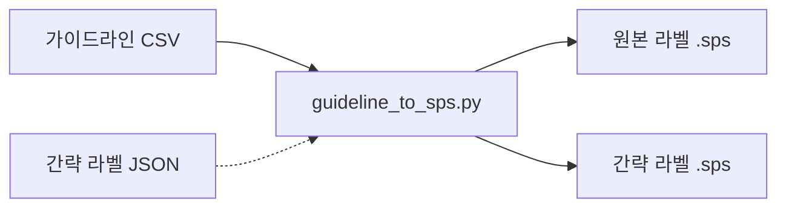

# SPSS Syntax 자동화 도구 - 결과 리포트

> **작성일**: 2026-02-26 | **도구 버전**: 1.0.0

---

## 1. 개발 배경

대구한의대학교 RISE사업 설문조사(학생/기업) 데이터에 SPSS 변수 라벨 및 값 라벨을 부여하기 위해, 변수 가이드라인 CSV를 `.sps` syntax 파일로 수동 변환하는 작업이 반복적으로 발생함.

이를 **범용 자동화 도구**로 통합하여, 동일한 CSV 형식을 따르는 모든 프로젝트에 재사용할 수 있도록 개발.

---

## 2. 도구 아키텍처

| 모듈                   | 역할                                              |
| ---------------------- | ------------------------------------------------- |
| `clean_text()`         | HTML entity, 스마트따옴표, CP949 비호환 문자 정리 |
| `parse_guideline()`    | CSV 4컬럼 파싱 → 변수/값 라벨 목록 추출           |
| `generate_sps()`       | VARIABLE LABELS + VALUE LABELS syntax 생성        |
| `apply_short_labels()` | JSON 매핑으로 간략 라벨 적용                      |
| CLI (argparse)         | 명령줄 인터페이스                                 |

---

## 3. 산출물

| 파일                       | 경로                        | 설명                   |
| -------------------------- | --------------------------- | ---------------------- |
| `guideline_to_sps.py`      | `SPSS\Automation\`          | 메인 스크립트          |
| `README.md`                | `SPSS\Automation\`          | 사용법·개발 가이드라인 |
| `CHANGELOG.md`             | `SPSS\Automation\`          | 업데이트 이력          |
| `short_labels_sample.json` | `SPSS\Automation\examples\` | 간략 라벨 JSON 예시    |

---

## 4. 검증 결과

기존 Student/Company 가이드라인 CSV로 범용 스크립트를 실행하여, 기존 개별 스크립트의 결과와 비교 검증.

### 4-1. Student 케이스

| 항목            | 기존 결과 | 범용 스크립트 | 일치 |
| --------------- | --------- | ------------- | ---- |
| 변수 라벨 수    | 67개      | 67개          | ✅    |
| 값 라벨 변수 수 | 64개      | 64개          | ✅    |
| 인코딩          | CP949     | CP949         | ✅    |

### 4-2. Company 케이스

| 항목            | 기존 결과 | 범용 스크립트 | 일치 |
| --------------- | --------- | ------------- | ---- |
| 변수 라벨 수    | 77개      | 77개          | ✅    |
| 값 라벨 변수 수 | 64개      | 64개          | ✅    |
| 인코딩          | CP949     | CP949         | ✅    |

---

## 5. 향후 확장 방안

| 항목          | 설명                                       |
| ------------- | ------------------------------------------ |
| Batch 모드    | 여러 CSV를 한 번에 처리하는 배치 실행 지원 |
| 자동 간략화   | LLM 기반 라벨 자동 요약 (현재 수동 JSON)   |
| SPSS 28+ 지원 | Unicode 모드 전용 옵션 강화                |
| 역변환        | `.sps` → CSV 가이드라인 역변환             |
