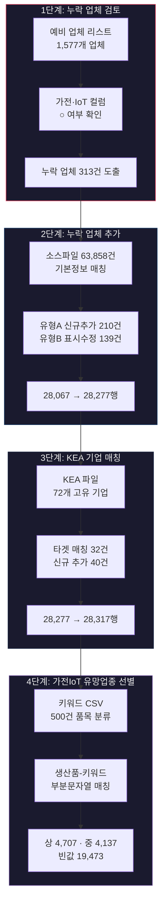
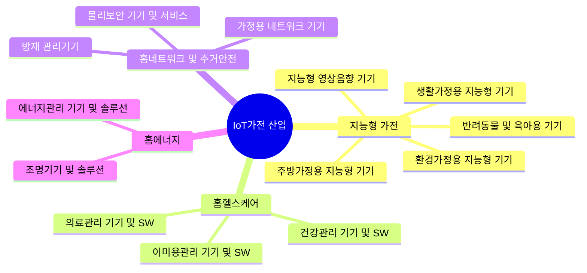

# IoT가전 업체 확정 프로세스 리포트

> **작성일**: 2026-03-18 | **대상 산업**: 전자·정보통신 + IoT가전

---

## 전체 프로세스 개요



---

## 1단계: 누락 업체 검토

### 목적
예비 업체 리스트에서 `기존자료(가전)` 또는 `기존자료(IoT)` 컬럼에 ○ 표시된 업체가 최종 리스트(10인 이상 업체)에 빠져있는지 검토.

### 입력 파일

| 파일 | 역할 | 건수 |
|------|------|------|
| [preliminary_comany_list_dup_checked_260312_1617F.csv](file:///d:/git_rk/data/factory_on/202601/company_list/electronics_iot/preliminary_comany_list_dup_checked_260312_1617F.csv) | 예비 업체 리스트 | 1,577 |
| [company_electronics_iot_employees_10_and_over_F_260310.csv](file:///d:/git_rk/data/factory_on/202601/company_list/electronics_iot/company_electronics_iot_employees_10_and_over_F_260310.csv) | 10인 이상 업체 리스트 (타겟) | 28,067 |

### 결과
- **누락 업체**: 313건 (가전 200건, IoT 153건, 일부 중복)
- 출력: [missing_companies_result.csv](file:///d:/git_rk/data/factory_on/202601/company_list/electronics_iot/missing_companies_result.csv)

---

## 2단계: 누락 업체 추가

### 목적
누락된 313건을 타겟파일에 추가하고, 비고 컬럼에 누락 사유 기재.

### 처리 유형

| 유형 | 설명 | 건수 |
|------|------|------|
| **유형 A** | 타겟 미존재 → 소스에서 기본정보 가져와 신규 행 추가 | 210 |
| **유형 B** | 타겟 존재하나 ○ 미표시 → ○ 표시 업데이트 | 139 |

### 유형 A 상세

| 소스 매칭 | 건수 | 비고 |
|-----------|------|------|
| 소스 매칭 성공 | 49 | 기본정보 전체 복사 |
| 소스 미등록 | 161 | 회사명만 기재 + `(소스파일 미등록)` |

### 변동

| 항목 | Before | After | 변동 |
|------|--------|-------|------|
| 총 행 수 | 28,067 | 28,277 | **+210** |
| 기존자료(가전) ○ | 367 | 567 | **+200** |
| 기존자료(IoT) ○ | 210 | 363 | **+153** |

### 산출물 (`260318_1514/` → `260318_1524/`)

| 파일 | 설명 |
|------|------|
| [company_electronics_iot_employees_10_and_over_F_260318_1524.csv](file:///d:/git_rk/data/factory_on/202601/company_list/electronics_iot/260318_1524/company_electronics_iot_employees_10_and_over_F_260318_1524.csv) | 전체 결과 (28,277행) |
| [added_companies.csv](file:///d:/git_rk/data/factory_on/202601/company_list/electronics_iot/260318_1524/added_companies.csv) | 신규 추가 210건 |
| [updated_mark_companies.csv](file:///d:/git_rk/data/factory_on/202601/company_list/electronics_iot/260318_1524/updated_mark_companies.csv) | 표시 업데이트 139건 |

---

## 3단계: KEA 기업 매칭

### 목적
한국전자정보통신산업진흥회(KEA) 회원사 목록과 매칭하여 `KEA(추가)` 컬럼에 ○ 표시. 미등록 기업은 소스파일에서 정보를 가져와 신규 추가.

### 입력

| 파일 | 역할 | 건수 |
|------|------|------|
| [(KEA) home_appliance_IoT.csv](file:///d:/git_rk/project/26_supply_demand/industry_classification/(KEA)%20home_appliance_IoT.csv) | KEA 회원사 목록 | 74 (고유 72) |
| 2단계 결과 파일 | 타겟 | 28,277 |
| [company_electronics_iot_extracted_F_260310.csv](file:///d:/git_rk/data/factory_on/202601/company_list/electronics_iot/company_electronics_iot_extracted_F_260310.csv) | 소스 (전체 공장DB) | 63,858 |

### 매칭 결과

| 구분 | 건수 | 처리 |
|------|------|------|
| 타겟 기존 매칭 | 32 | `KEA(추가)` = ○ |
| 신규 추가 (소스 매칭) | 9 | 행 추가 + 비고 기재 |
| 신규 추가 (공장DB 미등록) | 31 | 최소 정보 + 비고 기재 |
| **합계** | **72** | - |

### 변동

| 항목 | Before | After | 변동 |
|------|--------|-------|------|
| 총 행 수 | 28,277 | 28,317 | **+40** |
| KEA(추가) ○ | 0 | 82 | **+82** (중복 행 포함) |

### 산출물 (`260318_1536/`)

| 파일 | 설명 |
|------|------|
| [company_electronics_iot_employees_10_and_over_F_260318_1536.csv](file:///d:/git_rk/data/factory_on/202601/company_list/electronics_iot/260318_1536/company_electronics_iot_employees_10_and_over_F_260318_1536.csv) | 전체 결과 (28,317행) |
| [kea_added_companies.csv](file:///d:/git_rk/data/factory_on/202601/company_list/electronics_iot/260318_1536/kea_added_companies.csv) | KEA 신규 추가 40건 |

---

## 4단계: 가전IoT 유망업종 선별

### 목적
기업의 **생산품** 정보를 키워드 기반 IoT가전 분류표와 매칭하여, 가전IoT 관련성을 **상/중/하** 3단계로 평가.

### IoT가전 산업 분류 체계 (참조)



### 판정 기준

| 등급 | 조건 | 키워드 CSV 판정결과 | 예시 |
|------|------|---------------------|------|
| **상** | 직접 해당 | `해당` | 세탁기, 공기청정기, CCTV, LED조명, 정수기, 도어락 |
| **중** | 간접/예상 | `해당(예상)` 또는 `모호` | 전자부품, 통신장비, 센서모듈, 네트워크 장비 |
| 빈값 | 비관련 | `비해당` 또는 매칭 실패 | 자동차부품, 반도체, 금형, 산업용 장비 |

### 매칭 로직
1. 키워드 CSV(`iot_reclassified_cleaned_F(claud).csv`, 500건)의 `정제_생산품목명` 사전 구축
2. 타겟파일의 `생산품` 컬럼을 쉼표 분리 → 개별 품목 추출
3. **부분문자열 양방향 매칭** (키워드⊂생산품 또는 생산품⊂키워드)
4. 매칭된 품목 중 **최고 등급 적용** (상 > 중)

### 컬럼 변경

| 변경 유형 | 컬럼명 | 설명 |
|-----------|--------|------|
| 이름 변경 | `IoT` → `가전IoT` | 기존 값 유지 |
| 신규 추가 | `가전IoT_예상` | 상/중/빈값 |
| 신규 추가 | `예상_근거` | 매칭 키워드, 대분류, 세부분류 |

### 최종 판정 결과

| 등급 | 건수 | 비율 |
|------|------|------|
| **상** | 4,707 | 16.6% |
| **중** | 4,137 | 14.6% |
| 빈값 | 19,473 | 68.8% |
| **합계** | **28,317** | 100% |

### 교차 검증 (기존 가전IoT ○ vs 예상 등급)

| 기존 가전IoT ○ 기업 (25,939건) | 건수 |
|-------------------------------|------|
| 예상 **상** | 4,503 |
| 예상 **중** | 3,775 |
| 빈값 | 17,661 |

> [!NOTE]
> 기존 `가전IoT` ○ 는 전자·IoT 업종코드 기반 명부 등재 여부이므로, 생산품 키워드 매칭과는 독립적입니다. 빈값이 나오는 것은 해당 기업의 구체적 생산품이 분류 키워드에 포함되지 않는 경우로 정상입니다.

### 산출물 (`260318_1550/`)

| 파일 | 설명 | 규모 |
|------|------|------|
| [company_electronics_iot_employees_10_and_over_F_260318_1550.csv](file:///d:/git_rk/data/factory_on/202601/company_list/electronics_iot/260318_1550/company_electronics_iot_employees_10_and_over_F_260318_1550.csv) | 전체 결과 | 28,317행 |
| [iot_appliance_related_companies.csv](file:///d:/git_rk/data/factory_on/202601/company_list/electronics_iot/260318_1550/iot_appliance_related_companies.csv) | 상+중 등급 기업 | 8,844행 |

---

## 전체 데이터 흐름 요약

| 단계 | 처리 | 행 수(Before) | 행 수(After) | 추가 컬럼 |
|------|------|--------------|-------------|-----------|
| 1단계 | 누락 업체 검토 | - | 313건 도출 | - |
| 2단계 | 누락 업체 추가 | 28,067 | 28,277 (+210) | 비고 |
| 3단계 | KEA 매칭 | 28,277 | 28,317 (+40) | KEA(추가) |
| 4단계 | 가전IoT 선별 | 28,317 | 28,317 | 가전IoT_예상, 예상_근거 |

---

## 폴더 구조 (산출물)

```
electronics_iot/
├── 260318_1514/          ← 2단계 초기 결과
├── 260318_1524/          ← 2단계 타임스탬프 갱신
│   ├── company_..._F_260318_1524.csv  (28,277행)
│   ├── added_companies.csv            (210건)
│   └── updated_mark_companies.csv     (139건)
├── 260318_1536/          ← 3단계 KEA 매칭
│   ├── company_..._F_260318_1536.csv  (28,317행)
│   └── kea_added_companies.csv        (40건)
└── 260318_1550/          ← 4단계 최종 결과 ★
    ├── company_..._F_260318_1550.csv  (28,317행)
    └── iot_appliance_related_companies.csv (8,844행)
```
