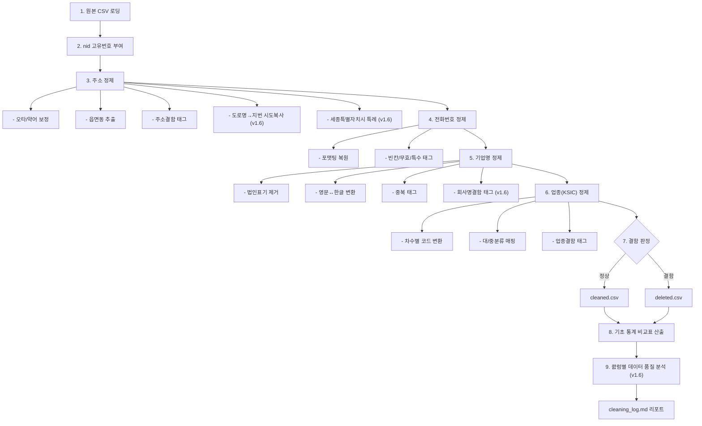

# 전국공장등록현황 데이터 정제 지침서 (v1.7 기준)

> **작성일**: 2026-03-04
> **최종 수정**: 2026-03-07 17:59
> **목적**: 데이터 파이프라인(v1.7)을 통한 전국공장등록현황 원본 데이터의 정제 기준 및 처리 절차 문서화

---

## 목차
1. [개요](#1-개요)
2. [정제 프로세스 모형](#2-정제-프로세스-모형)
3. [정제 파이프라인 구조](#3-정제-파이프라인-구조)
4. [단계별 정제 지침](#4-단계별-정제-지침)
   - [4.1. 고유 식별자(nid) 부여](#41-고유-식별자nid-부여)
   - [4.2. 주소 정제 및 읍면동 추출](#42-주소-정제-및-읍면동-추출)
   - [4.3. 전화번호 정제](#43-전화번호-정제)
   - [4.4. 기업명 정규화 및 영문화](#44-기업명-정규화-및-영문화)
   - [4.5. 업종(KSIC) 정제 및 분류 매핑](#45-업종ksic-정제-및-분류-매핑)
   - [4.6. 결함 데이터 분리](#46-결함-데이터-분리)
   - [4.7. 정제 과정별 기초 통계 비교](#47-정제-과정별-기초-통계-비교)
5. [최종 산출물 규격 (컬럼 레이아웃)](#5-최종-산출물-규격-컬럼-레이아웃)
6. [실행 방법 및 산출물](#6-실행-방법-및-산출물)
7. [버전 이력](#7-버전-이력)

---

## 1. 개요
본 지침서는 원본 데이터(`(2026.01)_National Factory Registration Status.csv`)에 포함된 주소, 전화번호, 기업명의 오류 및 불일치 요소를 수정하고, 고유 식별자(nid)를 부여하여 활용 가능한 고품질의 기업명부가 되도록 하는 데이터 정제 파이프라인의 기준을 정의합니다.

- **대상 데이터**: 전국공장등록현황 (2026년 1월 기준)
- **주요 목표**:
  1. 각 레코드에 유일한 ID 부여 (추후 DB화 대비)
  2. 불량/오류 데이터 필터링 및 분리 유지
  3. 기업명 중복 제거 및 영문 표기/외래어의 한글 정규화
  4. 지번/도로명 주소 정제 및 읍면동 행정구역 추출
  5. KSIC 11차 기준 업종 대분류·중분류 매핑 및 결함 처리

---

## 2. 정제 프로세스 모형

데이터 정제의 전체 흐름을 다음 다이어그램으로 표현합니다.



---

## 3. 정제 파이프라인 구조

파이프라인은 6개의 모듈과 1개의 통합 실행 스크립트로 구성됩니다:

```text
company_database/scripts/
├── 01_add_nid.py             # 고유 번호(nid) 발급
├── 02_clean_address.py       # 주소 오타/약어 수정, 읍면동 추출 및 유효성 검사
├── 03_clean_phone.py         # 전화번호 포맷팅 및 특수/무효 번호 제거
├── 04_clean_company_name.py  # 회사명 특수문자/법인표기 제거, 외래어 번역/음역 및 중복체크
├── 05_clean_industry.py      # [신규] 업종(KSIC) 정제 및 대분류/중분류 매핑
├── 06_split_deleted.py       # 정상 데이터와 결함 데이터 분리
├── 07_quality_check.py       # [신규 v1.6] 정제 후 컬럼별 품질 분석 (결측/고유값/이상치)
└── run_pipeline.py           # 파이프라인 통합 순차 실행 및 리포트/CSV 산출
```

**참조 데이터 경로** (KSIC 업종분류):
```text
database/statistical_classification/
├── 11th/
│   ├── KSIC1_*.csv           # 대분류 (21건, A~U)
│   └── KSIC2_*.csv           # 중분류 (77건, 01~99)
└── KSIC10th-KSIC11th.csv     # 10차→11차 코드 변환 매핑 (1,232건)
```

---

## 4. 단계별 정제 지침

### 4.1. 고유 식별자(nid) 부여 (`01_add_nid.py`)
- **형식**: `FC202601-NNNNNNNN` (FC + 년월 + 8자리 일련번호)
- **위치**: 데이터프레임의 최좌측(1번째 컬럼)에 삽입
- **검증**: 생성 후 해당 컬럼의 고유값 수와 전체 레코드 수가 일치하는지(`valid`) 검사합니다.

### 4.2. 주소 정제 및 읍면동 추출 (`02_clean_address.py`)
도로명 주소(`공장주소`) 및 지번 주소(`공장주소_지번`)를 기반으로 정제된 `공장주소_클리닝`, `공장주소_지번_클리닝`을 파생하고, 행정구역을 추출합니다.

- **텍스트 클리닝 (정제)**:
  - **오타 수정**: 자주 틀리는 시도명 오타 보정 (예: `충북남도` → `충청남도`)
  - **약어 확장**: 축약된 시도명을 공식 명칭으로 확장 (예: `충북` → `충청북도`)
  - **붙어쓰기 보정**: `시/도`와 `시/군/구` 사이의 띄어쓰기 복원 (예: `경기도수원시` → `경기도 수원시`)
  - **공백 정규화**: 2칸 이상의 다중 연속 공백을 1칸으로 정규화
- **읍면동명 추출**:
  - `공장주소_지번_클리닝` 및 `공장주소_클리닝` 데이터에서 정규식을 이용해 읍면동명을 추출하여 신규 컬럼 생성.
  - 검색 우선순위:
    1. 지번 주소 내 `읍/면` (예: 남양읍)
    2. 지번 주소 내 `동` (예: 신사동)
    3. 도로명 주소 소괄호 내 `()동` (예: (역삼동))
    4. 도로명 주소 내 `동` (예: 역삼동)
- **주소 결함 판별 (`_주소태그`)**:
  - 정제된 결과에도 기본 행정구역 단위인 정상적인 `시/도` + `시/군/구` 조합이 도출되지 않는다면 오류로 판단하고 `[삭제:주소결함]` 메모를 부여합니다.
- **시도명 역매핑** (v1.5 신규):
  - 정제 후 시도명이 빈칸으로 남는 경우, 시군구명을 기반으로 `SIGUNGU_TO_SIDO` 사전(전국 약 230개 시군구 매핑)을 통해 시도명을 역으로 추론합니다.
  - 예: `수원시 장안구 ...` (시도 누락) → `SIGUNGU_TO_SIDO["수원시"]` = `경기도`
- **완전 붙어쓰기 토큰화** (v1.5 신규):
  - 띄어쓰기가 전혀 없는 주소를 행정구역 경계(시/군/구/읍/면/동/리/로/길)에서 자동 분리합니다.
  - 예: `경기도수원시장안구이목동123` → `경기도 수원시 장안구 이목동 123`
  - 처리 순서: (1) VALID_SIDO 접두 기준 시도 분리 → (2) 시/군/구 경계 → (3) 읍/면/동/리 경계 → (4) 로/길 경계
- **구(기초) 분리** (v1.5 신규):
  - 시군구명에 일반시 산하 기초구(예: `수원시 장안구`)가 함께 있는 경우, `시군구명`에는 `수원시`만 남기고 `장안구`는 `구(기초)` 신규 컬럼으로 이동합니다.
  - 대상 시: 수원시, 성남시, 안양시, 안산시, 고양시, 용인시, 청주시, 천안시, 전주시, 포항시, 창원시 (총 11개시)
  - 비대상: 특별시/광역시의 자치구(예: 서울 강남구, 부산 해운대구)는 시군구명에 그대로 유지
- **도로명 주소를 통한 시도명 복원** (v1.6 신규):
  - 지번 주소와 도로명 주소 중 더 긴 쪽을 선택하는 기본 로직으로 시도명을 추출하였으나 여전히 빈칸인 경우, 구제하지 아니한 쪽 주소(도로명)에서 유효한 시도가 있는지 재검토하여 복원합니다.
  - 통계: `시도_도로명복사`
- **세종특별자치시 단층제 특례** (v1.6 신규):
  - 시도명이 `세종특별자치시`인 경우, 시군구명도 자동으로 `세종특별자치시`로 일괄 설정합니다. (세종시는 시와 도가 합쳐진 단층제 행정단위)
- **정제 최종 결과 — 시도명·시군구명 추출 불가 시 삭제** (v1.7 신규):
  - 위 모든 정제 단계(오타 보정 → 붙어쓰기 보정/토큰화 → 역매핑 → 도로명 보조 복사 → 세종시 특례)를 적용한 후에도 `시도명` 또는 `시군구명` 중 하나라도 빈칸으로 남는 업체는 **주소 정보를 신뢰할 수 없는 결함 데이터**로 판단합니다.
  - 해당 업체에는 `[삭제:주소결함] 시도/시군구 추출불가` 태그를 부여하고 `deleted.csv`(삭제 리스트)로 이동합니다.
  - **단계별 처리 순서 요약**:
    1. 오타·약어 보정, 붙어쓰기/공백 정규화
    2. 완전 붙어쓰기 토큰화
    3. 시군구→시도 역매핑(`SIGUNGU_TO_SIDO`)
    4. 도로명 주소에서 시도·시군구 보조 복사
    5. 세종특별자치시 단층제 처리
    6. **↑ 모든 단계 실패 → `[삭제:주소결함]` 태그 부여 → 삭제 리스트 이동**

### 4.3. 전화번호 정제 (`03_clean_phone.py`)
`전화번호` 형식과 유효성을 판별하여 통일된 규격으로 작성합니다.

- **포맷 정규화 및 복원**:
  - 기존 괄호, 마침표(`.`), 공백 등을 일괄적으로 정식 규격인 하이픈(`-`)으로 변경
  - 숫자로만 이루어져 있으나 유효 자릿수(10자리, 11자리)인 경우 지역번호(02, 031 등)나 식별번호(010, 070) 형태에 맞춰 자동 하이픈 복원
- **결함 처리 (`_전화태그`)**:
  - **무응답 (빈칸)**: 공백이거나 누락된 건 `[삭제:전화번호결함] 빈칸`
  - **특수번호 제한**: ARS나 18XX, 16XX, 15XX 등 대표번호 형태인 건 `[삭제:전화번호결함] 특수번호(X)`
  - **무효**: 규격을 한참 벗어나거나 자릿수 부족 형태 `[삭제:전화번호결함] 무효(X)`

### 4.4. 기업명 정규화 및 영문화 (`04_clean_company_name.py`)
기업명 중복 관리를 위한 표준 명칭(정규화)을 추출하고, 전면 영문화 컬럼을 신설합니다.

- **회사명 정규화 (4단계)** (`회사명_정규화` 생성):
  1. **법인 표기 제거**: `(주)`, `주식회사`, `(유)`, `(사)` 등의 법인, 영농조합 법인 표기 및 잔여 괄호 제거
  2. **괄호 내부 한글 활용**: 명칭 외부가 영문이고 내부가 한글이면 한글 부분을 주 명칭으로 승격 활용 (예: `ISK(아이에스케이)` → `아이에스케이`)
  3. **외래어의 한글 변환 적용**: `TECH`, `F&B`, `POWER` 등의 영문 단어나 `SK`, `SJ` 등 약어를 `ENGLISH_TO_KOREAN_WORDS` 사전 매핑을 통해 정식 형태의 한글 발음으로 변환 (`테크`, `에프앤비`, `에스케이` 등)
  4. **특수문자 및 공백 완전 제거**: 띄어쓰기 여부에 따른 중복을 막기 위해 띄어쓰기 및 특수문자 전면 제거
- **회사명 영문 변환** (`회사명_영문` 생성):
  - 앞서 정규화된 "한글 명칭 전체"를 영문 파생 변수로 변환.
  - `KOREAN_TO_ENGLISH` 매핑을 통해 한글 외래어를 원래 영단어로 1차 역번환 (예: `시스템즈` → `systems`)
  - 매핑되지 않은 순수 한글 고유어 등은 국어 로마자 표기법 간소화 함수(`hangul_to_roman`)를 이용해 2차 알파벳/로마자 음역 처리.
- **회사명 결함 삭제 태그** (`_회사명태그`) (v1.6 신규):
  - 회사명이 `-`, `.`, `*` 등 **특수문자만으로 구성**되어 정규화 시 빈 문자열이 되는 경우, `[삭제:회사명결함] 회사명확인불가(원본명)` 태그를 부여하여 **결함 데이터로 분리**합니다.
  - 이 태그는 `_회사명태그` 컬럼에 저장되며 `06_split_deleted.py`가 `TAG_COLS` 목록에서 학습하여 삭제 처리합니다.

- **동일 기업명 중복 태깅 (`회사명_비고`)**:
  - `회사명_정규화` 결과를 바탕으로 중복 건 존재 여부 파악 (`defaultdict` 로 인덱스 수집).
  - 결과적으로 2개 이상 행이 동일하다면, 대상들의 `회사명_비고` 컬럼에 `[중복] N건 - nid1, nid2 ...` 형식으로 관련 고유번호까지 태깅 처리.

### 4.5. 업종(KSIC) 정제 및 분류 매핑 (`05_clean_industry.py`)
원본 `대표업종` 코드(세세분류 5자리)를 KSIC 11차 기준으로 표준화하고, 대분류·중분류 코드 및 명칭을 파생합니다.

- **참조 데이터**: `database/statistical_classification/` 내 KSIC 11차 분류 CSV 및 10→11차 매핑 테이블
- **결함 검사 (`_업종태그`)**:
  - **빈칸**: `대표업종`이 공백/NaN → `[삭제:업종결함] 빈칸`
  - **무효 코드**: 숫자가 아니거나 5자리가 아님 → `[삭제:업종결함] 무효코드({값})`
  - **변환 실패**: 10차 코드인데 매핑 테이블에 없음 → `[삭제:업종결함] 변환실패({코드})`
  - **분류 매핑 실패**: KSIC2 테이블에 코드 매핑 불가 → `[삭제:업종결함] 분류매핑실패({코드})`
- **차수별 처리 전략**:
  - `차수 = 11` → 11차 코드 그대로 사용
  - `차수 = 10` → `KSIC10th-KSIC11th.csv` 매핑 테이블로 11차 코드 변환
  - `차수 = 0/빈칸/9/8 등` → **11차로 가정**하고 정상 처리
- **분류 파생**:
  - `대표업종코드(중)`: 11차 기준 `대표업종` 앞 2자리 추출
  - `대표업종명(중)`: KSIC2 테이블에서 중분류명 조회 (예: `인쇄 및 기록매체 복제업`)
  - `대표업종코드(대)`: 중분류 코드 범위로 대분류 알파벳 역매핑 (예: `C`)
  - `대표업종명(대)`: KSIC1 테이블에서 대분류명 조회 (예: `제조업`)
- **신규 컬럼 삽입 위치**: `대표업종` 좌측에 아래 순서로 4개 컬럼 삽입
  1. `대표업종코드(대)` — KSIC 대분류 알파벳 코드
  2. `대표업종명(대)` — KSIC 대분류 업종명
  3. `대표업종코드(중)` — KSIC 중분류 2자리 코드
  4. `대표업종명(중)` — KSIC 중분류 업종명

### 4.6. 결함 데이터 분리 (`06_split_deleted.py`)
- 과정 2~5에서 수집된 각종 내부 임시 태그(`_주소태그`, `_전화태그`, `_업종태그`, `_회사명태그` 등)를 순회 검사합니다.
- 태그에 `[삭제:` 라는 문자열이 단 하나라도 포함되어 있다면, 1개 컬럼이라도 조건 미달 처리하여 결함 리스트(`deleted_df`)로 이관합니다.
- 분리된 결함 행에는 최종 확인을 위한 병합된 `삭제사유` 컬럼을 생성합니다.
- 정상 리스트(`normal_df`)는 불필요해진 `삭제사유` 및 임시 태그 컬럼을 날려서 최종 산출물 규격으로 다듬어 냅니다.

### 4.7. 정제 과정별 기초 통계 비교 (`compute_comparison_stats()`)
정제 완료 후, 원본(모집단) / 정제 데이터 / 삭제 데이터의 핵심 지표를 **정제 과정별**로 대조하는 비교표를 자동 산출하여 리포트(`cleaning_log_*.md`) 하단에 포함합니다.

- **산출되는 소표 5개**:
  1. **총 레코드 현황**: 행/컬럼 수 및 분리 비중
  2. **주소 정제**: 결측치, 오타/약어 수정, 읍면동 추출, 주소결함 태그
  3. **전화번호 정제**: 유효/복원/결측/특수번호/무효 분포
  4. **기업명 정제**: 고유 회사명, 법인표기, 영문포함, 중복태그
  5. **업종(KSIC) 정제**: 매핑 성공, 고유 코드, 결함 현황
- **입력**: `raw_df`(원본 복사본), `normal_df`(정제), `deleted_df`(삭제) 3개 DataFrame 및 각 단계 통계 dict
- **출력**: 마크다운 리포트 문자열 (§8에 삽입)

### 4.8. 정제 후 컬럼별 데이터 품질 분석 (`07_quality_check.py`) (v1.6 신규)
정제 완료된 `normal_df`를 대상으로 컬럼별 품질을 점검하여 리포트 §5에 자동 삽입합니다.

- **5.1 컬럼별 결측값 현황**:
  - NaN 건수, 빈문자열(`""`) 건수, 결측 합계 및 비중(%), 고유값 수 컬럼별 산출
- **5.2 주소 품질 요약**:
  - 시도명/시군구명/읍면동명 빈칸 현황, `구(기초)` 많이 채워진 비율, 시군구명에 공백 잔존 여부
- **5.3 숫자 컬럼 이상치**:
  - 종업원/면적 등 9개 숫자 컬럼에서 비숫자 값 개수 및 샘플 표시

---

## 5. 최종 산출물 규격 (컬럼 레이아웃)

통합 파이프라인(`run_pipeline.py`) 실행 시, 분석 데이터베이스로서의 직관성을 위해 컬럼 순서가 최적 배치됩니다.

**[핵심 정보]**
1. `nid` (고유식별자)
2. `관리기관`
3. `회사명` (원본)
4. `회사명_정규화` (`[신규]` 정규식/변환/제거 완료된 한글 명칭)
5. `회사명_영문` (`[신규]` 정규화값에 대한 전체 로마자/영문화)
6. `회사명_비고` (`[신규]` 중복 내역, 원본 영문 포함 여부)

**[부지, 종류, 종업원 등 제반정보]**
7 ~ 26. `공장구분`부터 `생산품` 까지 (원본 순서 유지)

**[업종 관련 정보]**
27. `대표업종코드(대)` (`[신규]` KSIC 대분류 코드, 예: C)
28. `대표업종명(대)` (`[신규]` KSIC 대분류명, 예: 제조업)
29. `대표업종코드(중)` (`[신규]` KSIC 중분류 코드, 예: 18)
30. `대표업종명(중)` (`[신규]` KSIC 중분류명, 예: 인쇄 및 기록매체 복제업)
31. `대표업종` (원본 세세분류 5자리 코드)
32. `업종명` (원본)
33 ~ 41. `업종코드`부터 `필지수` 까지 (원본 순서 유지)

**[주소 관련 정보]**
42. `시도명`
43. `시군구명`
44. `구(기초)` (`[신규]` 일반시 산하 기초구, 예: 장안구 — v1.5)
45. `읍면동명` (`[신규]` 정제 주소 기반 자동 추출)
46. `공장주소` (원본 도로명)
47. `공장주소_클리닝` (`[신규]` 보정된 도로명 주소)
48. `공장주소_지번` (원본 지번)
49. `공장주소_지번_클리닝` (`[신규]` 보정된 지번 주소)

**[기타]**
50. `공장관리번호`

---

## 6. 실행 방법 및 산출물

```bash
# 터미널 창에서 스크립트 디렉토리로 이동
cd "d:\git_rk\database\company_database\scripts"

# 통합 파이프라인 스크립트 실행
python -u run_pipeline.py
# (또는 run.bat 스크립트 더블클릭)
```

**[디렉토리 구조]**
```text
company_database/
├── docs/                                  ← 지침서·정제 리포트
│   ├── factory_data_cleaning_guide_*.md
│   └── cleaning_reports/*.md
├── scripts/                               ← 파이프라인 스크립트
├── raw_data/factory_on/{YYYYMM}/raw/      ← 원본 데이터 (읽기 전용)
├── output/factory_on/{YYYYMM}/            ← 정제 결과 CSV
└── logs/factory_on/{YYYYMM}/              ← 실행 로그
```

**[산출물 3종]**
- **정상 데이터**: `output/factory_on/{YYYYMM}/factory_cleaned_{YYMMDD}_{HHMM}.csv`
- **삭제 (결함) 데이터**: `output/factory_on/{YYYYMM}/factory_deleted_{YYMMDD}_{HHMM}.csv`
- **리포트 (Log)**: `logs/factory_on/{YYYYMM}/cleaning_log_{YYMMDD}_{HHMM}.md`

---

## 7. 버전 이력

| 버전     | 주요 적용 모듈                      | 세부 내용                                                                                                                                  | 실행 시각 (YYMMDD_HHMM) |
| -------- | ----------------------------------- | ------------------------------------------------------------------------------------------------------------------------------------------ | ----------------------- |
| **v1.0** | 초기 개발 전반                      | 최초 파이프라인 (nid부여, 주소/전화 기초필터링, 법인명칭제거 등 1단계 정규화 및 분리)                                                      | 26/03/04 15:47          |
| **v1.1** | `02`, `run`                         | `읍면동명` 추출 등 주소 파싱 추가. 컬럼 순서 최적화(Reorder) 로직 및 원본/사본 컬럼 중복 제거                                              | 26/03/04 17:44          |
| **v1.2** | `04`, `run`                         | 영문↔한글 외래어 상호 변환 로직, `회사명_영문` 전체 로마자/영문 번역 파생 강화 적용                                                        | 26/03/04 18:10          |
| **v1.3** | `05(신규)`, `06`, `run`             | KSIC 11차 기준 업종 정제 및 대/중분류 매핑, 차수 변환(0/빈칸→11차 가정), 산출물 디렉토리 재구성                                            | 26/03/05 09:51          |
| **v1.4** | `run`                               | 정제 과정별 기초 통계 비교표 자동 산출 5개 소표(총레코드/주소/전화/기업명/업종), 원본 DataFrame 보관, 파일명 인수 지원                     | 26/03/05 11:17          |
| **v1.5** | `02`, `run`                         | 시도명 역매핑(SIGUNGU_TO_SIDO), 완전 붙어쓰기 토큰화, 구(기초) 컬럼 분리(일반시 11개시 산하 기초구), 통계 항목 추가                        | 26/03/07 16:40          |
| **v1.6** | `02`, `04`, `06`, `07(신규)`, `run` | 회사명결함 태깅/삭제 분리, 도로명 보조 복사로 시도명 보완, 세종특별자치시 단층제 특례, `07_quality_check.py` 신규 도입(컬럼별 품질 리포트) | 26/03/07 17:28          |
| **v1.7** | `02`, `run`                         | 최종 적용 후에도 시도명/시군구명 추출 불가 업체를 `[삭제:주소결함]` 태깅 후 삭제 리스트로 이동. 통계 `시도시군구_최종미추출` 신규          | 26/03/07 17:59          |
