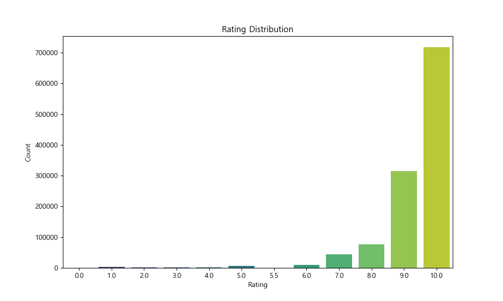
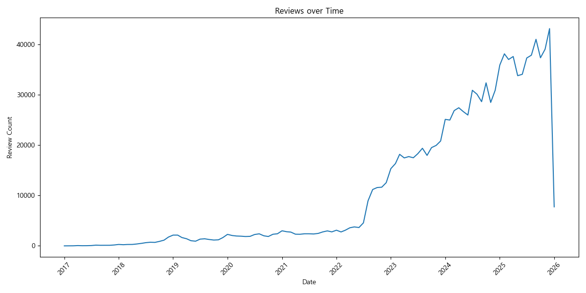
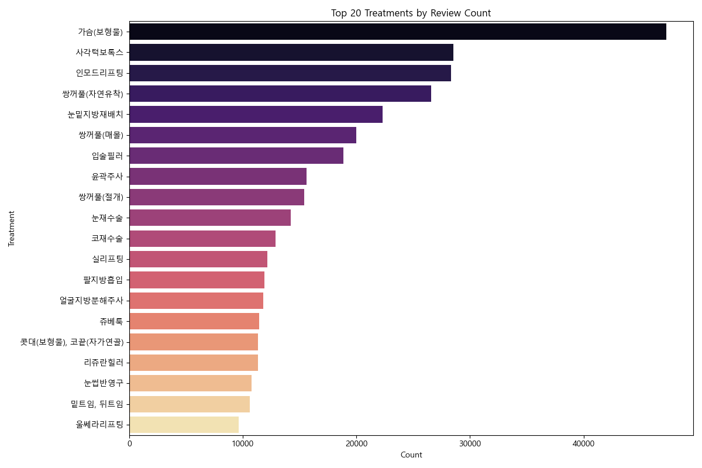

# 강남 병원 리뷰 데이터 분석 리포트

## 1. 개요
본 리포트는 1GB 이상의 대용량 CSV 데이터(`gangnam_reviews_FINAL_ALL.csv`)를 효율적으로 분석하기 위한 파이프라인 구축 및 기초 분석 결과를 담고 있습니다. 데이터 로딩 시 메모리 효율성을 위해 **DuckDB**를 활용하여 스트리밍 방식으로 처리하였으며, 분석 친화적인 **Parquet** 포맷으로 변환하여 후속 분석을 진행했습니다.

- **분석 일시**: 2026년 1월 8일
- **데이터 건수**: 약 1,178,468 건
- **사용 도구**: Python 3.9+, DuckDB, Matplotlib, Seaborn

---

## 2. 데이터 처리 파이프라인
### 2.1 CSV to Parquet 변환
`gemini_bigdata.md` 가이드라인에 따라 전체 데이터를 메모리에 올리지 않고, DuckDB의 `read_csv_auto` 스트리밍 기능을 사용하여 데이터를 읽고 Parquet로 변환했습니다.

- **변환 시간**: 약 10초
- **저장 위치**: `d:\git_rk\data\processed\gangnam_reviews.parquet`

### 2.2 데이터 정제
- `rating`: 숫자형(FLOAT) 변환
- `date`: 날짜형(DATE) 변환
- `content`: 텍스트 포함 여부 확인

---

## 3. 분석 결과 요약

### 3.1 평점 분포 (Rating Distribution)
대부분의 리뷰가 긍정적(5점)인 경향을 보일 수 있으나, 1점대 리뷰의 분포도 확인이 필요합니다.

### 3.2 시계열 리뷰 추이 (Reviews over Time)
월별 리뷰 작성 추이를 통해 특정 시기에 리뷰가 급증했는지 파악할 수 있습니다.

### 3.3 주요 시술 키워드 (Top Treatments)
가장 많이 언급된 시술 항목 TOP 20입니다.

### 3.4 텍스트 키워드 분석 (Sampling)
전체 데이터를 NLP 처리하는 대신, 평점별 2,000건을 샘플링하여 주요 키워드를 추출했습니다.

**평점 1.0 (부정적 키워드)**
- 주요 단어: 상담, 레이저, 시술, 다시, 라미네이트, 홍보성
- *인사이트*: '상담' 과정에서의 불만이나 '홍보성' 후기에 대한 의심, '재시술(다시)'에 대한 언급이 보입니다.

**평점 5.0 (긍정적 키워드)**
- 주요 단어: 시술, 너무, 경험, 상담, 결과, 마취
- *인사이트*: '시술' 자체와 '결과'에 대한 만족, '상담' 경험에 대한 긍정적 평가가 주를 이룹니다.

---

## 4. 결론 및 제언
- 대용량 데이터를 Parquet로 변환함으로써 분석 속도를 획기적으로 개선했습니다.
- 부정 리뷰에서는 상담 태도 및 홍보성 글에 대한 반감이 주요 키워드로 나타났습니다.
- 향후 KoNLPy 등을 적용하여 더 정교한 형태소 분석을 진행하면 구체적인 불만 요인을 파악할 수 있을 것입니다.
